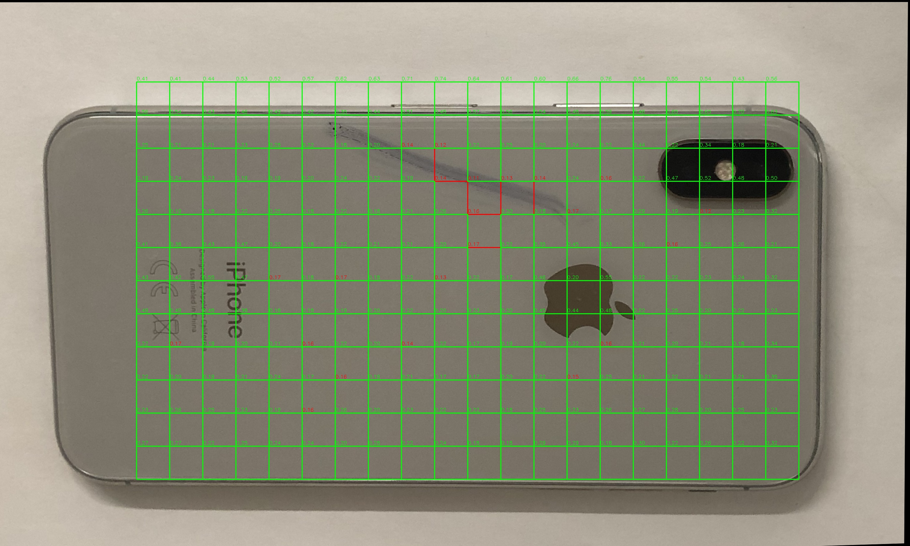
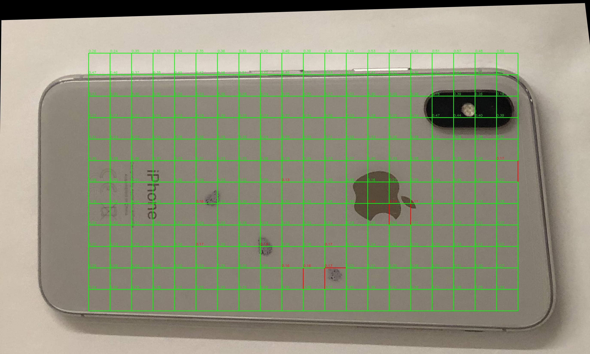

# iPhone Defect Detection Algorithm

This script implements an algorithm for detecting defects in iPhone images by comparing them with a reference image of a perfect iPhone. The algorithm uses various computer vision techniques to align the query image with the reference image and perform patch-wise similarity comparisons to identify dissimilar regions, which potentially indicate defects.

## Algorithm Overview

1. **Image Alignment**: The algorithm starts by aligning the query image (iPhone with potential defects) with the reference image (perfect iPhone). This is done using the following steps:
   - Convert both images to grayscale.
   - Detect and compute keypoints and descriptors using the SIFT (Scale-Invariant Feature Transform) algorithm.
   - Match the descriptors using the FLANN (Fast Library for Approximate Nearest Neighbors) matcher.
   - Filter good matches using the ratio test.
   - Find the homography matrix using RANSAC (Random Sample Consensus) to estimate the perspective transformation between the query and reference images.
   - Align the query image with the reference image using the obtained homography matrix.

2. **Border Removal**: To focus on the relevant regions of the aligned images, the algorithm removes a certain percentage (e.g., 15%) of the border on all four sides of both the reference and aligned query images.

3. **Patch-wise Similarity Comparison**: The algorithm divides the aligned images into smaller patches of a fixed size (e.g., 100x100 pixels) and compares the similarity between corresponding patches in the reference and query images. The similarity comparison is performed using the following steps:
   - Convert each patch to grayscale.
   - Compute the HOG (Histogram of Oriented Gradients) features for each patch.
   - Compare the HOG features of corresponding patches using the correlation method.
   - Classify patches as dissimilar if the similarity score is below a specified threshold (e.g., 0.17), indicating potential defects.

4. **Visualization**: The algorithm draws rectangles around the dissimilar patches in the aligned query image and labels them with the similarity scores. This helps visualize the regions where potential defects are detected.

5. **Output**: The script processes a set of query images located in the specified directory and saves the aligned query images with the detected defects in the output directory. It also generates a histogram of the number of dissimilar patches found in each query image, providing an overview of the defect distribution.

## Algorithm Explanation
First, the alignment is done, so that spurious difference in features due to camera positions is avoided.

Then the images are divided into patches and the similarity between the patches is calculated using HOG features.

This also solves the bonus problem of finding the location of the defect in the image, since we are using patches.

Some sample detections are shown below:

## Key Components

- `compare_patches`: This function takes two image patches as input, converts them to grayscale, computes their HOG features, and returns the similarity score between the patches using the correlation method.

- `find_similarity_patches`: This function performs the image alignment, border removal, and patch-wise similarity comparison steps. It takes the reference image and a query image as input and returns the lists of dissimilar and similar patches, along with the aligned query image.

- `images_set_path`: The directory path where the query images are located.

- `output_folder`: The directory where the output images with detected defects will be saved.

- `patch_threshold`: The minimum number of dissimilar patches required to consider an image as defective.

## Metrics

Since the samples are unlabelled, I am going to use the precision of my algorithm to understand the performance of the algorithm. If we have a labelled dataset, we can use the F1 score, which is the harmonic mean of precision and recall.

On multiple runnings of the algorithm, the precision was found to be 30% for a patch threshold of 30 and similarity threshold of 0.17. If we tune these parameters, we can get a better precision.

## Dependencies

- OpenCV (cv2): Used for image processing and computer vision tasks.
- NumPy: Used for numerical operations and array manipulation.
- scikit-image: Used for computing HOG features.
- Matplotlib: Used for generating the histogram of dissimilar patches.
- os and glob: Used for file and directory handling.
- tqdm: Used for progress tracking during image processing.

This algorithm provides an automated approach to detect defects in iPhone images by leveraging computer vision techniques. It can be useful for quality control and inspection purposes in the manufacturing or repair process of iPhones.